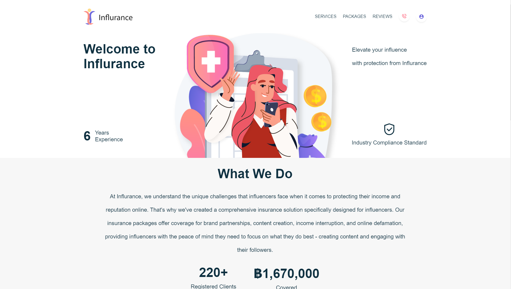

# Influrance

Fullstacks Insurance Application, Insurance for influencers.

# Installation

Client (port:3000)

        cd client
        npm i
        npm run dev

Server (port:3001)

        cd server
        npm i
        DEBUG=influrance-api/* npm start

## Technologies Used

**Main**

- **MongoDB** - database
- **Express** - backend
- **React** - frontend
- **NodeJS** - backend

**Misc.**

- **vite** - build react app
- **crypto-random-string** - generate secure random string
- **emailjs** - sending email
- **framer-motion** - animation
- **js-cookies**
- **lottie-web** - lottie animation
- **moment** - handling date
- **sass** - styling

## Deployment

n/a

## User Stories

Use should be able to:

- Choose package
- Register
- Login
- View purchased details

## Known Issues

- Dashboard responsiveness
- Form Validation both login and register.
